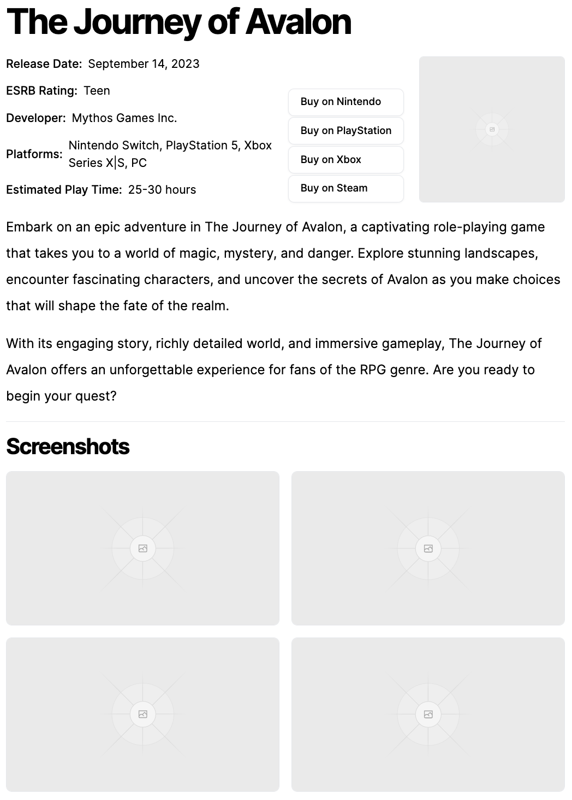

# BunkGaming

Welcome to the Technical Test for Bunk!

For this technical test we expect candidates to spend between 1-3 hours to look through this README and the code and then make a number of commits associated to the following tasks.

Candidates will not only be judged on their coding strengths, but also on their ability to make good commits, spot areas of code that could be improved and proactiveness, among other things.

## Cloning Instructions

1. Clone this repository `git clone git@github.com:rentbunk/bunk-gaming.git`
2. Remove this repository from remote `git remote remove origin`
3. Create a [new repository](https://github.com/new) using your own GitHub account named `bunk-gaming` (feel free to )
4. Add your own remote `git remote add origin git@github.com:GITHUB_USERNAME/bunk-gaming.git`
5. Push to your own repository `git push -u origin main`
6. Add `alexpchin` and `chazuk` to the list of collaborators https://github.com/GITHUB_USERNAME/bunk-gaming/settings/access

## Tasks

Candidates are expected to complete at least TWO of the following tasks:

1. Complete a selection of example User Stories and Tasks
2. Update and improve the Developer Experience of the codebase and document that changes that will effect other developers
3. Analyse the codebase and create a number of GitHub Issues to be undertaken by the team (in the style of a Jira ticket you'd expect to work on)
4. Implement a feature that would showcase a particular expertise or talent and document the feature to present to stakeholders

After you have completed the test, please make sure that all code is on the main branch, and update the README with any instructions, thoughts and feedback you deem necessary.

## User Stories

### BK-4478 - Story: Display list of Games by Developer

**As a user,** I want to be able to see a list of games for each developer so that I can easily find games created by my favorite developers.

#### Requirements:

1. Clicking on a Developer should take the user to the games by developer page.
2. Present the developers name and information from the API.
3. Present a list of games associated with that developer from the API.
4. The list should include the title, image and any other information you think is relevant.
5. Ensure the feature is responsive and accessible on various devices and screen sizes.
6. Clicking on a Game should take the user to the associated games page

### BK-4712 - Story: Update design of Game page

**As a user,** I want the Game page to have an updated design so that I can enjoy a more visually appealing and user-friendly experience when exploring game information.

#### Requirements:

1. The updated design should match the provided design specifications in terms of layout and interactive elements.
2. Implement a responsive design to ensure the Game page looks and functions well on various devices and screen sizes.
3. Ensure that all interactive elements (buttons, links, etc.) have appropriate accessibility features (e.g., keyboard navigation, screen reader compatibility).
4. Add a screenshots section underneath the detail section.
5. **OPTIONAL** Include new sections for additional information returned from the API to provide users with more comprehensive game information.

### BK-9000 - Story: Implement Pagination for the List of Games

As a user, I want to navigate through the list of games using pagination so that I can easily access a large catalog without overwhelming load times or scrolling issues.

#### Requirements

1. The pagination feature should be implemented at both the frontend (Angular) and backend to efficiently manage data fetching.
2. Users should be able to navigate through pages using "Previous" and "Next" buttons (selecting specific page numbers directly is not required).
3. The UI for the pagination should be responsive and match the current design language of the application.
4. Ensure that the current page number is clearly indicated.
5. **OPTIONAL** Implement lazy loading or a similar strategy to further improve the performance and user experience of navigating the list.

## Tasks

### BK-5423 - Task: Fix broken tests

There are a number of tests that are currently blocking us from deploying the latest features to production.

### BK-6212 - Task: Refactor Game Card and List to be consisent across application

The Home page and Platform Games page both show a list of Games, but each has it's own custom styling. This should be refactored to use a single component to display Game Cards and a list of Games.

There is a proposed design below, but most of the information can be excluded for the simple card.

#### Requirements:

1. All tests must pass when running `npm run test`

## RAWG API

To get access to the [RAWG](https://rawg.io/) API you'll need to complete the following steps:

1. [Sign up](https://rawg.io/signup) to RAWG
2. Navigate to your [Developer Dashboard](https://rawg.io/login/?forward=developer)
3. Complete the form with your name, a fake site url or your GitHub profile and a short description of why you're using the API
4. Copy the API key from the [Developer Dashboard](https://rawg.io/login/?forward=developer)
5. Go to `src/environments/environment.ts` and paste the API key under `rawg.api_key`

The API offers 20,000 requests a month, so you should not run out of requests or run into any rate limiting.

The full API documentation is found at [https://api.rawg.io/docs/](https://api.rawg.io/docs/)

## Project Info

This project was generated with [Angular CLI](https://github.com/angular/angular-cli) version 15.2.11.

### Getting started

After cloning the project, run `npm i` in your terminal to install all dependencies.

### Development server

Run `ng serve` for a dev server. Navigate to `http://localhost:4200/`. The application will automatically reload if you change any of the source files.

### Code scaffolding

Run `ng generate component component-name` to generate a new component. You can also use `ng generate directive|pipe|service|class|guard|interface|enum|module`.

### Build

Run `ng build` to build the project. The build artifacts will be stored in the `dist/` directory.

### Running unit tests

Run `ng test` to execute the unit tests via [Karma](https://karma-runner.github.io).

### Running end-to-end tests

Run `ng e2e` to execute the end-to-end tests via a platform of your choice. To use this command, you need to first add a package that implements end-to-end testing capabilities.

### Further help

To get more help on the Angular CLI use `ng help` or go check out the [Angular CLI Overview and Command Reference](https://angular.io/cli) page.
